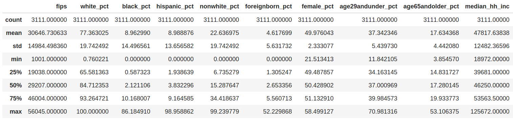
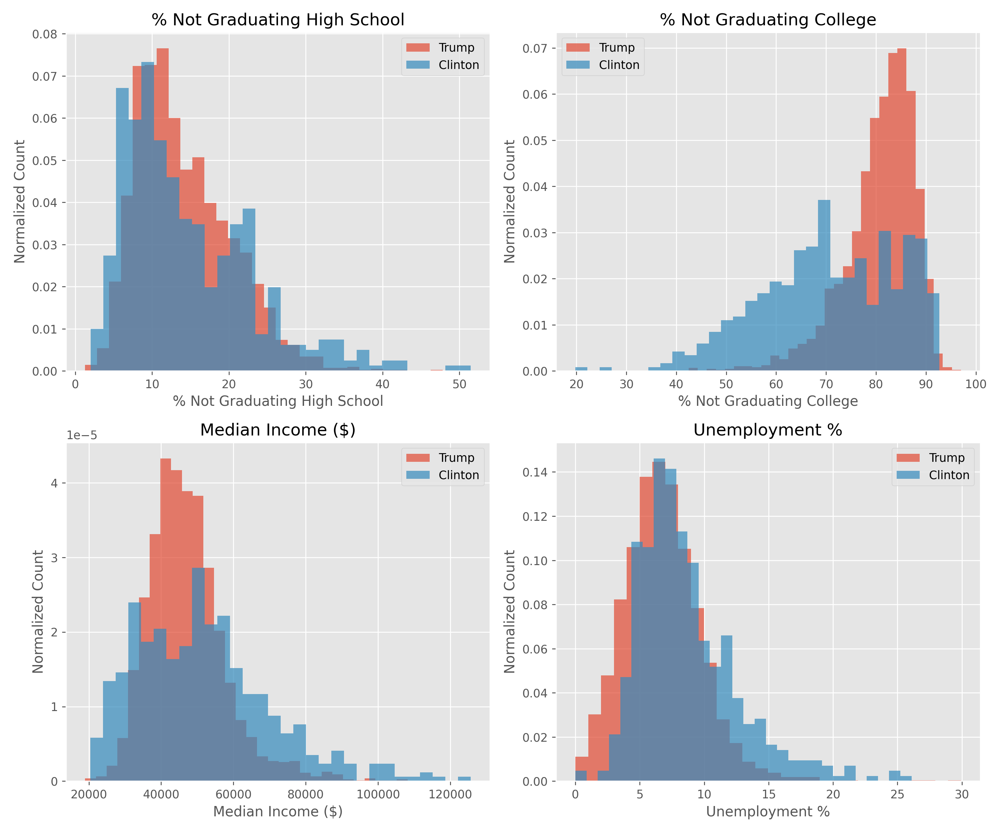
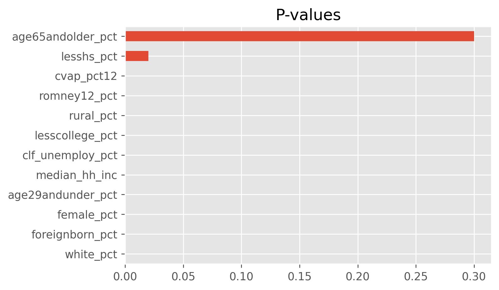
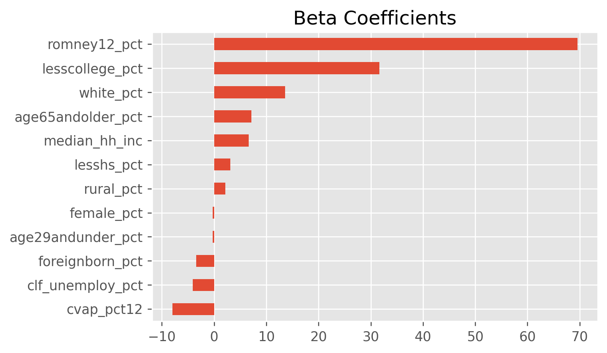
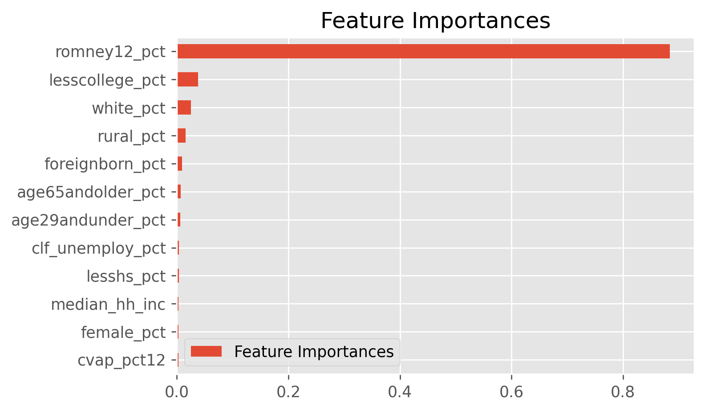
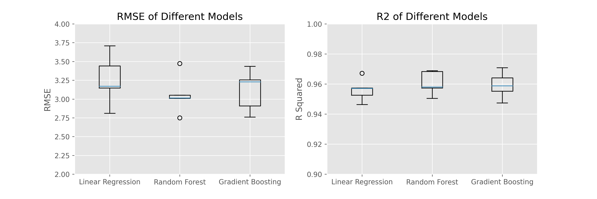
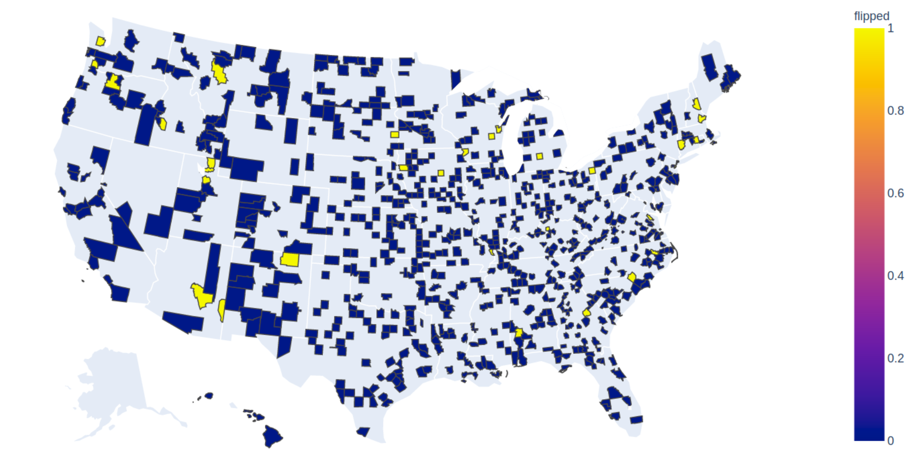
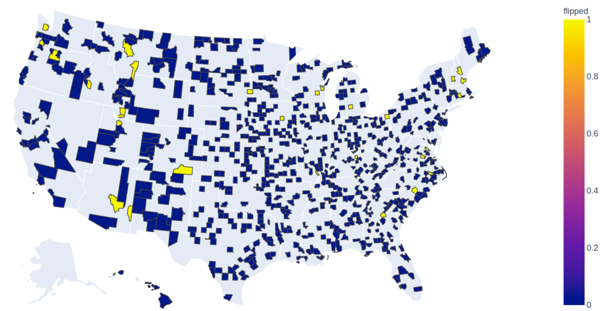

# Predicting the Presidential Election

<a href="https://github.com/mkpetterson">Maureen Petterson</a>

## Table of Contents

- <a href="https://github.com/mkpetterson/2016_elections#introduction">Introduction</a>  
- <a href="https://github.com/mkpetterson/2016_elections#data-preparation-and-exploratory-data-analysis">Data Preparation and Exploratory Data Analysis</a> 
- <a href="https://github.com/mkpetterson/2016_elections#modeling-linear-regression">Statistical Analysis</a>  
- <a href="https://github.com/mkpetterson/2016_elections#prediction-results">Prediction Results</a> 
- <a href="https://github.com/mkpetterson/2016_elections#conclusion">Conclusion</a>
- <a href="https://github.com/mkpetterson/2016_elections#notes">Notes</a>

## Introduction

The 2016 presidential election was a divisive, highly-charged event that added new urgency to the same questions the United States confronts every 4 years: How could forecasting models be so wrong in predicting the winner? Should we continue using an outdated electoral college system in which the winner of the popular vote loses the election? Do voters vote in their own interest, or instead stick to the same party despite changes in party platform?

Predicting the winner of the election is no small task. While certian demographics are both highly correlated with each other and highly correlated to political parties (see <a href='https://en.wikipedia.org/wiki/Multilevel_model'>multilevel modeling</a>), many other factors come into play: major event occuring in the months preceeding the election, geographical regions might favor a local candidate regardless of her/his political affiliation, the strength of the economy, and even faithless electors who cast votes outside of who they are pledged to. It can be difficult to capture all of these in a single model. 

The goal of this project is to predict the presidential election using only demographics for each county in the United States. While this model won't account for any of the complex factor listed above, it can still provide decent results and more complexity can be added to the resultant model. The data, taken from the <a href="https://electionlab.mit.edu/data">MIT Election Lab</a>, contains various information for each of the 3114 counties throughout the US. 

## Data Preparation and Exploratory Data Analysis

### Data Preparation

The dataset required some cleaning and manipulating prior to building and evaluating the models. First, non-relavent columns and null rows were removed from the dataset, followed by creation of new features and one hot encoding (OHE) of some categorical variables. 

- 14 columns were dropped, which contained voting results in 2016 for the house, senate, and governor races. This information wouldn't have been available prior to the 2016 election and shouldn't be used as features in the model.
- 3 counties with missing demographic data were removed from the dataset.
- Additionally, the 2014 results for govenor were excluded. While this is expected to be an important feature, it was missing in 31% of the counties. Counties without the data couldn't be included in the results and the missing data can't be filled in with the mean. The best solution would be to create two different models: one with the data and one without. 

- Vote count results for the 2016 and 2012 elections were turned into percentages of the total votes for each county.
- A column was added for the percentage of eligible voters who voted in the 2012 election. 
- The 'rural_cc' column, which is a categorical variable describing the county as rural, metro, or urban (metro-adjacent or non-metro-adjacent), was replaced with 4 boolean columns. 
- Further EDA showed that a few columns were highly correlated and thus should be removed for linear regression. Non-white percent, percent white who have less than a high school education, and the percent white who have less than a college education were all removed as they were redundant with the racially neutral columns with similar metrics. 
- Similarly, Hispanic percent and black percent were removed as they are highly correlated with white percent. 

Snapshot of the original dataset:

The cleaned up dataset:

A screenshot showing statistics from a few of the features in the dataset:

 

While state, county, and fips will not be used in the regression or classification model, they will be needed for some initial exploratory data analysis and will be dropped at a later time. 

### Exploratory Data Analysis

Working on the training set only, we did some EDA to look at the distribution of the features. Below are several different plots highlighting correlations and distributions in the data. First we looked at choropleth maps of the counties to get a good visual of a few demographics. Note the 3 counties in Arizona who went to a 3rd party candidate. 

<h5><b>Candidate with the most votes</b></h5>

Below are a few other plots looking more closely at demographic data. Most are broken down into counties that voted majoriy-Trump or majority-Clinton. These plots highlight some interesting trends, namely that there isn't a large different along educational or income lines, with the exception that highly educated counties (>50% of the population has a college degree) voted almost exclusively for Clinton. One of the largest predictors appears to be whether or not the county previously voted for Romney or Obama.

The correlations plot, aside from showing features that are highly correlated and redundant, proved useful in determining which features are highly dependent and thus need to be removed prior to running the linear regression model.

    
Correlation Heatmap

    
Education, Income, and Unemployment Breakdown

    
Previous Election Results and Misc Demographics

## Modeling: Linear Regression and Random Forest Regression

Regression was chosen for the initial model. Since we are looking at county-level data and not state-level data, it makes more sense to do a regression to predict the percentage of votes each candidate receives, then multiply that by the voting population to get a total vote count for each county. All the counties in a given state are tallied and the majority winner wins the state. The process flow is as follows:

- Removal of third party candidate <a href="https://www.google.com">1</a>
- Normalization of all dataset features <a href="https://www.google.com">2</a>
- KFold for iterative, randomized train/test splits (for linear regression)
- Linear or Random Forest regression for prediction of the percentage of a county who voted for Trump
- Error analysis using mean squared error and R2
- Extraction of beta parameters and p-values to find most important/signifiant features
- Summing predicted votes for each county and tallying the difference in votes for each candidate

    
Linear Regression

    
     
Most of the p-values are significant, which is a little surprising given some of the overlap seen in the histograms generated in the EDA section. Most notably, unemployment percent and the percent not finishing high school are significant in the model, but the histograms for Trump vs Clinton supporters are nearly identical. However, the beta values for these two are markedly smaller than the beta values for other significant variables. The lack of true independence between features could be the cause of p-values that seem to defy intuition. 
 
    

Feature engineering was investigated and found to be unnecessary due to the high performance of the native features.
 

<b>Model Performance</b> 
- KFold RMSE range from 3.06 - 3.68, with an average value of 3.36. 
- KFold R2 values ranged from 0.94 - 0.97, with an average value of 0.95.
- The p-value of OLS model was 0.000, indicating that the linear regression model was able to accurately predict the percentage of votes Trump would receive in a given county based solely off demogrpahics and previous election results. 

<b>Model Performance with Feature Reduction</b>
Using a scatter matrix as a guide, features that appeared to be highly correlated were iteratively removed to see the effect on the model. RMSE and R2 values are the average over 5 folds using KFold. 

- 1st iteration: RMSE 3.36, R2 0.95 - Initial model
- 2nd iteration: RMSE 3.32, R2 0.95
- 3rd iteration: RMSE 3.36, R2 0.95

Features in 2nd iteration: 
As above, but removed 'obama12_pct'

Features in 3rd iteration:  
As above, but removed OHE features 'metro', 'rural', 'urban_metroadj', 'urban_not_metroadj'

Below are the p-values and betas corresponding to iteration 3: the model using the fewest features. It's interesting to note that as certain features are removed, the p-values of the remaining features change to become slightly less important. Nonetheless, the performance of all 3 models is still quite good. 

<b>Overall, the model performs well based on the performance metrics.</b>     
     

    
Random Forest Regression

     
    
Random Forest is a bit more of a black box than linear regression. Feature importances are found by calculating the Gini importances. However, the model still performed as well, if not slightly better than linear regression. 

<b>Model Performance</b> 
- KFold RMSE range from 2.86 - 3.35, with an average value of 3.15. 
- KFold R2 values ranged from 0.95 - 0.97, with an average value of 0.96.
  
    
Feature Importances as found by Random Forest

    
Gradient Boosting Regression

     
    
Gradient Boosting Regressor takes advantage of adding many weak learning together with the aim to minimize variance and prevent overfitting. Feature importances are found by calculating the Gini importances. This model performed roughly the same as the Random Forest. 
    
<b>Model Performance</b> 
- KFold RMSE range from 2.63 - 3.80, with an average value of 3.05. 
- KFold R2 values ranged from 0.94 - 0.97, with an average value of 0.96.  
    
Feature Importances as found by Random Forest

 

The model performance can be summarized in the plot below.  

## Prediction Results

Of the 778 counties in the test set, 95-97% of them were accurately predicted by all models to have either Trump or Clinton as the forerunner. A choropleth map of the counties in the testing set is shown below, with blue representing accurate predictions, while yellow represents counties with a different predicted forerunner. 

The top plot is from the linear regressor, while the bottom plot is for the gradient boosting regressor. They are similar, although have different predicted frontrunners for a few counties. 

Unfortuantely, updated demographic information is not yet available, so the predictions can't yet be extended to the 2020 elections. 

## Conclusion

Despite the simplicity of the model and the fact that some of the features were correlated, the predictions were fairly accurate. Both the RMSE and R2 metrics were well within acceptable ranges and 97% of the 778 counties still predicted the same frontrunner. The discrepancy in votes between the predicted and true votes was only 110 across all 778 counties in the test set. 

Updated demographic information could be fed into the same model to accurately predict the 2020 election, although recent events and constituent sentiment would likely add value if it could be incorporated. 

One of the most important features, both by p-value and by visual analysis of histograms, is how the county voted in previous elections. Republican voters tend to vote republican and democrat voters tend to vote for republicans. A county flipping parties, which happened in the 2016 elections, likely is caused by factors other than demographics. Scraping twitter feeds, facebook posts, or looking at media consumed might give better insights into the pulse of the public. 

## Notes

<b>Footnotes</b>

1. Removal of third party option from the regression model was done. Sigificant third party votes are often not predicted by information in the demographics table, but rather from other characteristics that can't be accounted for in this linear regression. We are assuming that a third party candidate will evently pull votes off the republican and democratic candidates, nullifying the overall affect. Thus, the prediction model will only predict for the percentage of vote for Trump and assume Clinton is 100-Trump. 

2. Typically standardization, which both centers and scale each feature to have a mean of 0 and standard deviation of 1, is done on all features prior to regression analysis. In this particular case, standardization gave different p-values for the features than normalization or no scaling. This is thought to be due to the fact that this dataset partially violates the requirement for independence between all the features, making the p-values of each feature vary based on the chosen pre-processing method. One way to avoid this would be with multilevel modeling, but in this case it was decided to use normalization, and not standardization, on all features prior to training the regression model.  
    
<b>Sources</b> 
County demographic data taken from the MIT Election Lab <a href="https://electionlab.mit.edu/data">(source)</a> 
Geojson data for choropleth maps taken from <a href='https://raw.githubusercontent.com/plotly/datasets/master/geojson-counties-fips.json'>here</a>
