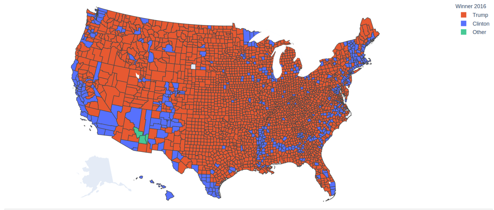

# Predicting the Presidential Election

<a href="https://github.com/mkpetterson">Maureen Petterson</a>

## Table of Contents

- <a href="https://github.com/mkpetterson/2016_elections#introduction">Introduction</a>  
- <a href="https://github.com/mkpetterson/2016_elections#data-preparation-and-exploratory-data-analysis">Data Preparation and Exploratory Data Analysis</a> 
- <a href="https://github.com/mkpetterson/2016_elections#models-investigated">Models Investigated</a>  
- <a href="https://github.com/mkpetterson/2016_elections#prediction-results">Prediction Results</a> 
- <a href="https://github.com/mkpetterson/2016_elections#conclusion">Conclusion</a>
- <a href="https://github.com/mkpetterson/2016_elections#running-the-code">Running the Code</a>

## Introduction

The 2016 presidential election was a divisive, highly-charged event that added new urgency to the same questions the United States ponders every 4 years: How could forecasting models be so wrong in predicting the winner? Should we continue using an outdated electoral college system in which the winner of the popular vote loses the election? Do voters vote in their own interest, or instead stick to the same party despite changes in party platform?

Predicting the winner of the election is no small task. While certian demographics are both highly correlated with each other and highly correlated to political parties (see <a href='https://en.wikipedia.org/wiki/Multilevel_model'>multilevel modeling</a>), many other factors come into play: major event occuring in the months preceeding the election, geographical regions might favor a local candidate regardless of her/his political affiliation, the strength of the economy, etc. It can be difficult to capture all of these in a single model. 

This project is an attempt at predicting the presidential election using only county demographics. While this model won't account for any of the complex factor listed above, it can still provide decent results and more complexity can be added to the resultant model. 

## Data Preparation and Exploratory Data Analysis

### Data Preparation

The dataset required some cleaning and manipulating prior to building and evaluating the models. First, non-relavent columns and null rows were removed from the dataset, followed by creation of new features and one hot encoding (OHE) of some categorical variables. 

- 14 columns were dropped, which contained voting results in 2016 for the house, senate, and governor races. This information wouldn't have been available prior to the 2016 election and shouldn't be used as features in the model.
- 3 counties with missing demographic data were removed from the dataset.
- Additionally, the 2014 results for govenor were excluded. While this is expected to be an important feature, it was missing in 31% of the counties. Counties without the data couldn't be included in the results and the missing data can't be filled in with the mean. The best solution would be to create two different models: one with the data and one without. 

- Vote count results for the 2016 and 2012 elections were turned into percentages of the total votes for each county.
- A column was added for the percentage of eligible voters who voted in the 2012 election. 
- The 'rural_cc' column, which is a categorical variable describing the county as rural, metro, or urban (metro-adjacent or non-metro-adjacent), was replaced with 4 boolean columns. 
- Further EDA showed that a few columns were highly correlated and thus should be removed for linear regression. Non-white percent, percent white who have less than a high school education, and the percent white who have less than a college education were all removed as they were redundant with the racially neutral columns with similar metrics. 

Snapshot of the original dataset:

The cleaned up dataset:

While state, county, and fips will not be used in the regression or classification model, they will be needed for some initial exploratory data analysis and will be dropped at a later time. 

### Exploratory Data Analysis

Working on the training set only, we did some EDA to look at the distribution of the features. Below are several different plots highlighting correlations and distributions in the data. First we looked at choropleth maps of the counties to get a good visual of a few demographics. Note the 3 counties in Arizona who went to a 3rd party candidate. 

This first choropleth plot was made by looking at the candiate in each county with the highest number of votes.

Below are a few other plots looking more closely at demographic data. Most are broken down into counties that voted majoriy-Trump or majority-Clinton. These plots highlight some interesting trends, namely that there isn't a large different along educational or income lines, with the exception that highly educated counties (>50% of the population has a college degree) voted almost exclusively for Clinton.  

The correlations plot, aside from showing features that are highly correlated and redundant, also shows some strong correlations with the presidential candidates.  

    
Correlation Heatmap

    
Income and Unemployment Breakdown

    
Education

## Models Investigated

## Prediction Results

## Conclusion

## Running the Code